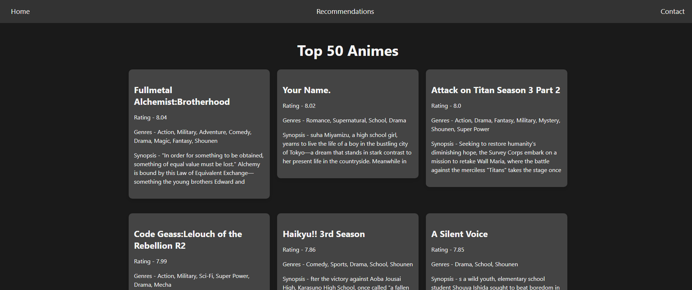
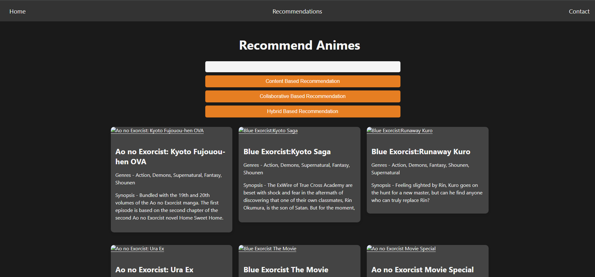

# Anime-Recommendation-System

This project is an Anime Recommendation System that provides recommendations based on content-based, collaborative-based, and hybrid-based approaches. The dataset used for this project can be found on [Kaggle](https://www.kaggle.com/datasets/hernan4444/anime-recommendation-database-2020).

## Table of Contents
- [Installation](#installation)
- [Dataset](#dataset)
- [Project Structure](#project-structure)
- [Data Preprocessing](#data-preprocessing)
- [Recommendation Systems](#recommendation-systems)
  - [Content-Based Recommendation](#content-based-recommendation)
  - [Collaborative-Based Recommendation](#collaborative-based-recommendation)
  - [Hybrid-Based Recommendation](#hybrid-based-recommendation)
- [Usage](#usage)
- [Contributing](#contributing)
- [License](#license)
- [Reference Images](#reference-images)

## Installation

1. Clone the repository:
    ```sh
    git clone https://github.com/Tushar041100/Anime-Recommendation-System.git
    cd Anime-Recommendation-System
    ```

2. Create a virtual environment and activate it:
    ```sh
    python -m venv venv
    source venv/bin/activate  # On Windows use `venv\Scripts\activate`
    ```

3. Install the required packages:
    ```sh
    pip install -r requirements.txt
    ```

## Dataset

The dataset used in this project can be found on [Kaggle](https://www.kaggle.com/datasets/hernan4444/anime-recommendation-database-2020). Download the dataset and place it in the [Dataset](http://_vscodecontentref_/1) directory.

## Project Structure

Anime-Recommendation-System\
├── app.py\
├── Dataset/\
│	├── anime.csv\
│   ├── animelist.csv\
│   ├── anime_with_synopsis.csv\
│   ├── rating_complete.csv\
│   └── watching_status.csv\
├── Images/\
│   ├── HomePage.png\
│   └── RecommendationPage.png\
├── model/\
│   ├── animes.pkl\
│   ├── cosine_sim.pkl\
│   ├── linear_sim.pkl\
│   ├── pivot_table.pkl\
│   └── popular_anime.pkl\
├── Notebooks/\
│   ├── anime-recommender-system.ipynb\
│   ├── generated.ipynb\
│   └── popularity-based-anime-recommender-system.ipynb\
├── README.md\
├── requirements.txt\
└── templates/\
    ├── index.html\
    └── recommend.html\

Note: The model and Dataset folders were not checked in. You can generate the models from the code present in the notebooks and get the dataset from the link provided above.

## Data Preprocessing

1. Load the datasets using pandas.
2. Merge and clean the datasets to create a unified dataframe.
3. Scale the features.
4. Save the preprocessed data to `anime_features_scaled.csv`.

## Recommendation Systems

### Content-Based Recommendation

1. Create a TF-IDF matrix of the anime tags.
2. Compute the cosine similarity between the TF-IDF vectors.
3. Recommend animes based on the similarity scores.

### Collaborative-Based Recommendation

1. Create a pivot table of user ratings.
2. Compute the cosine similarity between the user rating vectors.
3. Recommend animes based on the similarity scores.

### Hybrid-Based Recommendation

1. Combine the content-based and collaborative-based recommendation scores.
2. Recommend animes based on the combined scores.

## Usage

1. Run the Flask application:
    ```sh
    python app.py
    ```

2. Open your web browser and go to `http://127.0.0.1:5000/`.

3. Enter the name of an anime and choose the recommendation type (Content-Based, Collaborative-Based, or Hybrid-Based).

## Contributing

Contributions are welcome! Please open an issue or submit a pull request for any improvements or bug fixes.

## License

This project is licensed under the MIT License.

## Reference Images

Here are some reference images used in this project:

